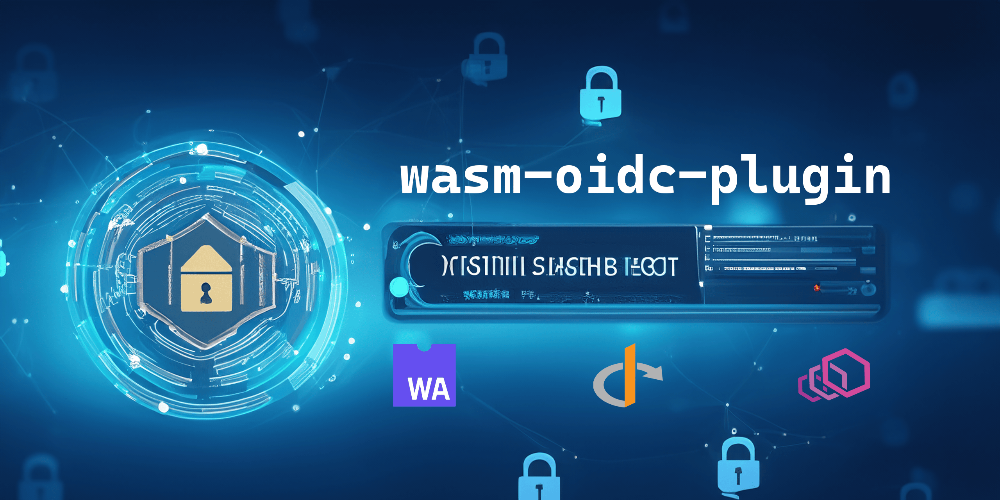
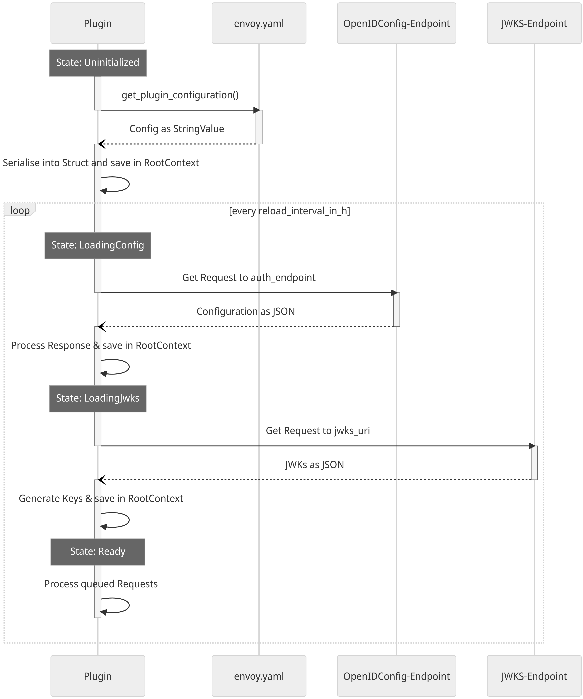
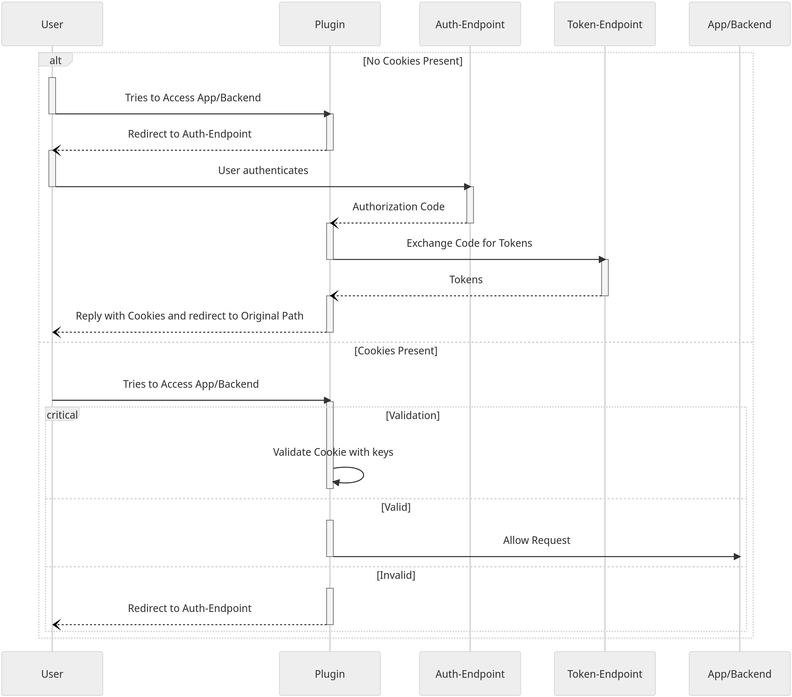

# wasm-oidc-plugin

[](https://github.com/antonengelhardt/wasm-oidc-plugin/actions/workflows/build.yml) [](https://antonengelhardt.github.io/wasm-oidc-plugin/wasm_oidc_plugin/index.html#)

A Wasm-plugin for the [Envoy-Proxy](https://www.envoyproxy.io/) written in [Rust](https://www.rust-lang.org) acting as an HTTP Filter, that implements the OpenID Authorization Code Flow. Requests sent to the filter are checked for the presence of a valid session cookie. If the cookie is not present, the user is redirected to the `authorization_endpoint` to authenticate. After successful authentication, the user is redirected back to the original path with the authorization code in the URL query. The plugin then exchanges the code for a token using the `token_endpoint` and stores the token in the session. If the cookie is present and decryptable, the plugin validates the token and passes the request to the backend, if the token is valid (optional).

## Demo

Go to [demo-page](https://demo.wasm-oidc-plugin.ae02.de) to see the plugin in action. [Auth0](https://auth0.com) is used as the OpenID provider. Simply create an account or login with Google. The plugin has been configured to show [httpbin.org](https://httpbin.org) as the upstream. Then open the developer tools and check the cookies or use the [httpbin cookie inspector](https://demo.wasm-oidc-plugin.ae02.de/#/Cookies/get_cookies). You will see a cookie called `oidcSession-0`. This is the session, that holds the authorization state. If you delete the cookie and refresh the page, you will be redirected to the `authorization_endpoint` to authenticate again.

## Why this repo?

This repo is the result of a bachelor thesis in Information Systems. It is inspired by two other projects: [oidc-filter](https://github.com/dgn/oidc-filter) & [wasm-oauth-filter](https://github.com/sonhal/wasm-oauth-filter). This project has several advantages and improvements:

1. **Encryption**: The session in which the authorization state is stored is encrypted using AES-256, by providing a Key in the config and a session-based nonce. This prevents the session from being read by the user and potentially modified. If the user tries to modify the session, the decryption fails and the user is redirected to the `authorization_endpoint` to authenticate again.
2. **Multiple OpenID Providers**: The plugin can be configured with multiple OpenID providers. This is useful if you have multiple services that are protected by different OpenID providers. The user can then choose which provider to authenticate with on some auth page.
3. **Configuration**: Many configuration options are available to customize the plugin to your needs. More are coming ;)
4. **Stability**: The plugin aims to be stable and ready for production. All forceful value unwraps are expected to be valid. If the value may be invalid or in the wrong format, error handling is in place.
5. **Optional validation**: The plugin can be configured to validate the token or not. If the validation is disabled, the plugin only checks for the presence of the token and passes the request to the backend. This is because the validation is taking a considerable amount of time. This time becomes worse with the length of the signing key. Cryptographic support is not fully mature in WASM yet, but [there is hope](https://github.com/WebAssembly/wasi-crypto/blob/main/docs/HighLevelGoals.md).
6. **Documentation and comments**: The code is documented and commented, so that it is easy to understand and extend.

## Install

### Install Toolchain for WASM in Rust

For developing the [Rust Toolchain](https://www.rust-lang.org/tools/install) has to be installed and the WASM target has to be enabled. E.g. for Ubuntu this can be achieved by:

```sh
# Install Build essentials
apt install build-essential
# Install Rustup
curl --proto '=https' --tlsv1.2 -sSf https://sh.rustup.rs | sh
# Enable WASM compilation target
cargo build --target wasm32-wasip1 --release
```

## Run

**Shortcut** (make sure to have [make](https://www.gnu.org/software/make/) installed):

```sh
make run
```

---

### Detailed variant

1. **Building the plugin:**

```sh
cargo build --target wasm32-wasip1 --release
# or
make build
```

2. **Testing locally with Envoy** ([docker](https://www.docker.com/) and [docker-compose](https://docs.docker.com/compose/install/) are needed):

```sh
docker compose up
```

3. **Requests to the locally running envoy with the plugin enabled:**

```sh
curl localhost:10000
```

## Deploy to Kubernetes

To deploy the plugin to production, the following steps are needed (either manually or via a [CI/CD pipeline](./k8s/ci.yml)):

1. Build the plugin

   1.1 with `cargo build --target wasm32-wasip1 --release` - this can be done in a [initContainer](./k8s/deployment.yaml) (see [k8s](./k8s) folder) and then copy the binary to the path `/etc/envoy/proxy-wasm-plugins/` in the envoy container.

   1.2 by using the pre-built Docker image [antonengelhardt/wasm-oidc-plugin](https://hub.docker.com/r/antonengelhardt/wasm-oidc-plugin).

2. Run envoy as a container with the `envoy.yaml` file mounted through the [ConfigMap](./k8s/configmap.yml) as a volume.
3. Set up [Service](./k8s/service.yml), [Certificate](./k8s/certificate-production.yml), [Ingress](./k8s/ingress.yml) to expose the Envoy to the internet.

For reference, see the [k8s folder](./k8s).

## Documentation

To generate a detailed documentation, run (also [hosted on GitHub Pages](https://antonengelhardt.github.io/wasm-oidc-plugin/wasm_oidc_plugin/index.html#)):

```sh
cargo doc --document-private-items --open
```

### Configuration

The plugin is configured via the `envoy.yaml`-file. The following configuration options are required:

| Name | Type | Description | Example | Required |
| ---- | ---- | ----------- | ------- | -------- |
| `exclude_hosts` | `Vec<Regex>` | A comma separated list Hosts (in Regex expressions), that are excluded from the filter. | `["localhost:10000"]` | ❌ |
| `exclude_paths` | `Vec<Regex>` | A comma separated list of paths (in Regex expressions), that are excluded from the filter. | `["/health"]` | ❌ |
| `exclude_urls` | `Vec<Regex>` | A comma separated list of URLs (in Regex expressions), that are excluded from the filter. | `["http://localhost:10000/health"]` | ❌ |
| `access_token_header_name` | `string` | If set, this name will be used to forward the access token to the backend. | `X-Access-Token` | ❌ |
| `access_token_header_prefix` | `string` | The prefix of the header, that is used to forward the access token, if empty "" is used. | `Bearer ` | ❌ |
| `id_token_header_name` | `string` | If set, this name will be used to forward the id token to the backend. | `X-Id-Token` | ❌ |
| `id_token_header_prefix` | `string` | The prefix of the header, that is used to forward the id token, if empty "" is used. | `Bearer ` | ❌ |
| `cookie_name` | `string` | The name of the cookie, that is used to store the session. | `oidcSession` | ✅ |
| `logout_path` | `string` | The path, that is used to logout the user. The user will be redirected to `end_session_endpoint` of the OIDC provider, if the server supports this; alternatively the user is sent to "/" | `/logout` | ✅ |
| `filter_plugin_cookies` | `bool` | Whether to filter the cookies that are managed and controlled by the plugin (namely cookie_name and `nonce`). | `true` | ✅ |
| `cookie_duration` | `u64` | The duration in seconds, after which the session cookie expires. | `86400` | ✅ |
| `token_validation` | bool | Whether to validate the token or not. | `true` | ✅ |
| `aes_key` | `string` | A base64 encoded AES-256 Key: `openssl rand -base64 32` | `SFDUGDbOsRzSZbv+mvnZdu2x6+Hqe2WRaBABvfxmh3Q=` | ✅ |
| `reload_interval_in_h` | `u64` | The interval in hours, after which the OpenID configuration is reloaded. | `24` | ✅ |
| `open_id_configs` | `Vec<OpenIdConfig>` | A list of OpenID Configuration objects. | See below | ✅ |

#### `OpenIdConfig`

| Name | Type | Description | Example | Required |
| ---- | ---- | ----------- | ------- | -------- |
| `name` | `string` | The name of the OpenID provider (this will be shown on the Auth Page). | `Google` | ✅ |
| `image` | `string` | The URL to the image of the OpenID provider (this will be shown on the Auth Page). | `https://upload.wikimedia.org/wikipedia/commons/thumb/2/2f/Google_2015_logo.svg/2560px-Google_2015_logo.svg.png` | ✅ |
| `config_endpoint` | `string` | The open id configuration endpoint. | `https://accounts.google.com/.well-known/openid-configuration` | ✅ |
| `upstream_cluster` | `string` | The name of the upstream cluster in your Envoy configuration. | `httpbin` | ✅ |
| `authority` | `string` | The authority of the `authorization_endpoint`. | `accounts.google.com` | ✅ |
| `redirect_uri` | `string` | The redirect URI, that the `authorization_endpoint` will redirect to. | `http://localhost:10000/oidc/callback` | ✅ |
| `client_id` | `string` | The client ID, for getting and exchanging the code. | `wasm-oidc-plugin` | ✅ |
| `scope` | `string` | The scope, to validate | `openid email` | ✅ |
| `claims` | `string` | The claims, to validate. Make sure to escape quotes with a backslash | `{\"id_token\":{\"groups\":null,\"username\":null}}` | ✅ |
| `client_secret` | `string` | The client secret, that is used to authenticate with the `authorization_endpoint`. | `secret` | ✅ |
| `audience` | `string` | The audience, that is used to validate the token. | `wasm-oidc-plugin` | ✅ |

With these configuration options, the plugin starts and loads more information itself such as all OpenID provider's public keys, issuer, etc.

### States

For that a state is used, which determines, what to load next. The following states are possible and depending on the outcome, the state is changed or not:

| State | Description |
| ---- | ----------- |
| `LoadingConfig` | The plugin is loading the configuration from all `config_endpoint`s. |
| `LoadingJwks` | The plugin is loading the public keys from all `jwks_uri`. |
| `Ready` | The plugin is ready to handle requests and will reload the configuration after the `reload_interval_in_h` has passed. |

Below is a state diagram for one single OpenID Provider



### Handling a request

When a new request arrives, the root context creates a new http context with the information that has been loaded previously.

Then, one of the following cases is handled:

1. The plugin is not configured yet and still loading the configuration. The request is paused and queued until the configuration is loaded. Then, the RootContext resumes the request and the Request is redirected in order to create a new context.
2. The request is excluded from the filter. The request is passed to the backend without any further checks.
3. The request has the authorization code in the URL query. This means that the user has been redirected back from the `authorization_endpoint` after successful authentication. The plugin exchanges the code for a token using the `token_endpoint` and stores the token in the session. Then, the user is redirected back to the original request.
4. The request has a valid session cookie. The plugin decoded, decrypts and then validates the cookie and passes the request depending on the outcome of the validation of the token.
5. The request has no valid session cookie. The plugin redirects the user to the `authorization_endpoint` to authenticate. Once, the user returns, the second case is handled.



## Tools

### Git Cliff

[Git-Cliff](https://github.com/orhun/git-cliff) automates the generation of changelogs, when following [conventional commit messages](https://www.conventionalcommits.org/en/v1.0.0/)

### Gitleaks

We are using [Gitleaks](https://github.com/gitleaks/gitleaks) to protect from unwanted secret leaking and prevent security incidents by detecting passwords, secrets, API keys, tokens and more in git repos.

To run gitleaks, install it first and then run:

```bash
gitleaks protect

# To get the list of leaks
gitleaks protect --verbose
```

If you want to install a pre-commit hook - you should - install [pre-commit](https://pre-commit.com/) and run (from the root of the project):

```bash
pre-commit install
```

The pre-commit hook will also check for a clean code style, formatting best practices and enforce clippy lints.

### Cargo-Deny

Cargo-deny checks all dependencies for security vulnerabilities and license issues.

Install cargo-deny:

```bash
cargo install --locked cargo-deny
```

And then run:

```bash
cargo-deny check licenses
cargo-deny check advisories
```

These commands are also run in the CI pipeline.

## FAQ

> My OpenID provider uses a different endpoint for the jwks_uri. How can I configure this?

Google does exactly that:

```json
{
  "jwks_uri": "https://www.googleapis.com/oauth2/v3/certs"
}
```

You can add the endpoint in your `envoy.yaml`-file like this:

```yaml
- name: google
      connect_timeout: 5s
      type: STRICT_DNS
      dns_lookup_family: V4_ONLY
      load_assignment:
        cluster_name: google
        endpoints:
          - lb_endpoints:
              - endpoint:
                  address:
                    socket_address:
                      address: accounts.google.com
                      port_value: 443
              - endpoint:
                  address:
                    socket_address:
                      address: www.googleapis.com
                      port_value: 443
```

The rest should work fine.
